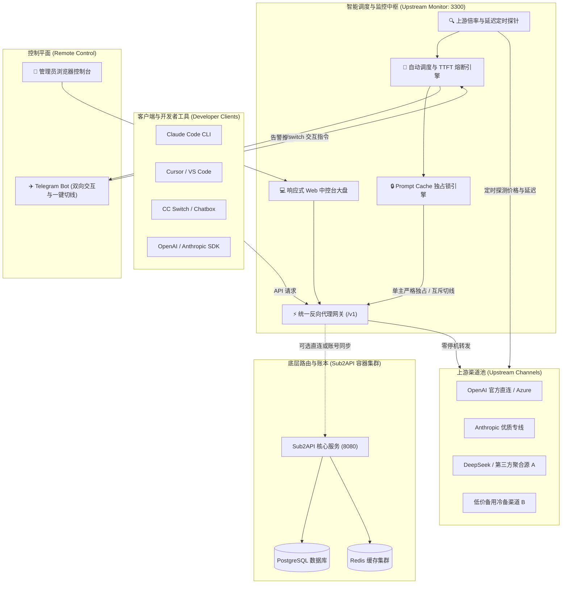

<div align="center">

# 🗼 中转塔台 · Relay Tower

**企业级全栈 AI 大模型聚合中转网关 · 智能上游倍率差分监控 · 毫秒级零停机热切换 · 独家 Prompt Cache 锁定保护 · Telegram 移动端调度中枢**

[](LICENSE)
[](https://nodejs.org/)
[](docker-compose.yml)
[](https://claude.ai)
[](https://cursor.com)
[](CONTRIBUTING.md)
[](https://telegram.org)

[English](README_EN.md) · [简体中文](README.md) · [为什么选择本项目？](#-为什么选择-relay-tower) · [核心特性](#-核心特性矩阵) · [系统架构](#-系统架构) · [快速开始](#-快速开始) · [客户端接入](#-客户端无缝接入指南) · [常见问题](#-常见问题-faq)

</div>

---

## 📌 GitHub 检索与技术标签 (Topics & Tags)

> **Keywords:** `ai-gateway` `llm-proxy` `claude-code` `cursor-ai` `deepseek-api` `openai-proxy` `anthropic-proxy` `new-api` `one-api` `prompt-cache` `rate-limiter` `circuit-breaker` `load-balancer` `telegram-bot` `docker-compose` `reverse-proxy`

---

## 📖 项目简介

在当下的大模型（LLM）API 分发与中转站运营中，开发者与中转站运营者面临着几大核心痛点：
1. **上游悄悄调高倍率**：上游供应商可能在半夜或高峰期暗中上涨进货倍率，导致中转站产生巨额亏损；
2. **多渠道分流破坏 Prompt Cache**：为了容灾开启了主副调双开，导致 Claude Code、Cursor、DeepSeek 的上下文请求在多个上游节点之间轮询横跳，**提示词缓存 (Prompt Cache) 命中率归零，Token 费用翻倍且响应延迟暴涨**；
3. **突发断流与宕机无法离机切线**：深夜上游突然宕机或被封禁，运维无法立刻开电脑登录后台切换通道；
4. **客户端热切换成本高**：传统中转系统切换渠道需要客户端重启或重新配置。

**中转塔台 (Relay Tower)** 是专为解决上述痛点而打造的开源高可用大模型中转网关与智能监控调度系统。它由**上游倍率智能监控中枢**、**零停机统一反向代理网关 (`/v1`)**、**Telegram 手机端双向切线机器人**以及**开箱即用的 Sub2API 容器化全栈部署套件**构成，是构建高可用、高性价比大模型中转服务的企业级终极底座。

---

## ⚖️ 为什么选择 中转塔台 (Relay Tower)？(横向对比)

| 功能特性 / 考量维度 | 传统反代 (Nginx / Caddy) | 原生 One-API / New-API | **中转塔台 (Relay Tower) (本项目)** |
| :--- | :---: | :---: | :---: |
| **上游进货倍率探针与差分感知** | ❌ 无感知 | ❌ 仅配置固定售价 | ✅ **实时探测进货倍率，秒级感知调价动作** |
| **高危涨价强告警与备选熔断** | ❌ 无告警 | ❌ 无告警 | ✅ **主力涨价声光+Telegram强提醒，一键切至低价备选** |
| **Prompt Cache 单主严格独占锁定** | ❌ 轮询分流 | ❌ 主副调并行导致缓存击穿 | ✅ **独家特性：物理关停副调，锁死 90%+ 缓存命中率** |
| **Telegram 手机端双向交互切线** | ❌ 无 | ❌ 仅单向被动推送 | ✅ **手机端弹出 Inline Keyboard，点击按钮秒级切线** |
| **客户端零停机热切换 (`/v1`)** | ❌ 需改配置或重载 | 需进后台改权重并等待缓存刷新 | ✅ **接入网关统一终结点，后台切线客户端完全无感** |
| **首字延迟 (TTFT) 超时智能熔断** | ❌ 仅能检测 HTTP 5xx | ❌ 仅检测普通超时 | ✅ **统计真实流式首字耗时，自动熔断假死/断流通道** |
| **商业进销利差与毛利率大盘** | ❌ 无 | ❌ 仅统计用户用量 | ✅ **实时计算各上游毛利差与利润率，标红亏损通道** |
| **内网穿透 / 免公网 IP 离机运维** | ❌ 需公网与 SSL 证书 | 需公网后台访问 | ✅ **Telegram Bot 采用 Long Polling，内网也能直接操控** |

---

## ✨ 核心特性矩阵

### 1. 📊 实时上游倍率大盘与智能探针
- **成本倍率即时透视**：支持自动对接主流 New-API / One-API `/api/pricing` 价格探针，实时大盘呈现各渠道最新进货倍率（如 `0.65x`, `0.85x`, `1.10x`）。
- **网络延迟与真实连通性探活**：周期性向各上游渠道发起轻量探针，毫秒级反馈延迟（ms）与健康状态。
- **进销毛利动态核算**：结合终端销售分组倍率，自动核算毛利差（Spread）与利润率（Margin %），实时高亮亏损通道。

### 2. 🚨 差分调价感知与高危涨价强告警
- **差分算法秒级捕获**：一旦上游渠道倍率发生微调，系统立刻捕获变化幅度（如 `0.65x -> 1.10x (+69.2%)`）。
- **全维度立体报警**：屏幕居中强警示弹窗 + Web Audio 合成声效警报 + 完整调价审计日志。
- **主力通道涨价一键熔断**：当正在出海的主力通道被上游暗度陈仓涨价时，系统自动触发红色高危警报，并在消息界面提供“一键切换到更低倍率备选通道”快捷按钮。

### 3. 🔒 单主调严格独占与 Prompt Cache 锁定保护 (独家突破)
- **拒绝双开分流**：同业务分组内严格仅开启当前主调调度，所有副调通道强制设为冷备关停 (`schedulable=false, priority=10`)，彻底避免主副调并行分流打散上下文。
- **物理锁死 Prompt Cache**：确保高频对话与长上下文 AI 编程（Claude Code CLI、Cursor、DeepSeek）每次请求均精确命中同一上游实例缓存，**削减高达 70%+ 的 Token 资费并大幅缩短响应时间**。
- **原子互斥交接**：切线操作（手动切换或自动熔断）执行原子 SQL 事务，瞬间关停旧主调、激活新主调，切线瞬间零分流冗余。

### 4. ⚡ 零停机智能反向代理网关 (Smart Proxy Gateway)
- **统一接入终结点**：对外开放统一端口 `http://localhost:3300/v1`。
- **毫秒级无感切换**：客户端（Claude Code CLI、Cursor、CC Switch、Chatbox、NextChat）配置此端口后，中控台无论如何切换上游，客户端**无需重启、无需修改配置，零停机毫秒级即时生效**。
- **内置代理分流验证器**：中控台内嵌真实请求测试器，可随时模拟客户端调用，即时核验当前生效通道的分流效果。

### 5. ✈️ Telegram 机器人离机中控 (Telegram Bot Remote Console)
- **离机实时预警推送**：
  - 上游进货倍率变动实时告警（附带涨跌百分比与变动渠道）；
  - 主力通道涨价高危警报（消息底部附带低价备用线路的 **一键切换交互按钮**）；
  - 首字延迟 (TTFT) 超时熔断或上游宕机切线报告。
- **手机端双向交互与一键切线**：
  - `/status`：查看当前主力通道、进货倍率、销售毛利率、延迟与自动切线状态；
  - `/switch`：弹出所有上游通道的 **Inline Keyboard 点击交互按钮**，在手机上点击任意渠道秒级完成调度切线；
  - `/auto`：在手机上一键开关自动切线保护，或切换成本优先/极速优先策略；
  - `/rates`：输出所有上游渠道进货倍率从低到高天梯榜；
  - `/check`：立即发起全量上游价格探针与测速巡检。
- **长轮询架构**：采用 Long Polling 机制，内网、本地 Docker、无公网 IP VPS 均无需域名或 SSL 证书即可开箱即用。

### 6. 🛡️ 自动化故障转移与首字延迟 (TTFT) 熔断
- 实时统计真实流式请求的建立时间与首字时间（Time to First Token）。当检测到通道故障、5xx 错误超标或首字等待超时（TTFT Spike）时，自动平滑转移至备选候选池。

---

## 🏗️ 系统架构



---

## 📂 项目模块结构

```
├── 🚀 upstream-monitor/            # 核心系统：上游监控中枢与调度网关
│   ├── public/                    # 现代化响应式 Web UI (大盘看板、策略面板、在线调试器)
│   ├── server.js                  # 统一智能反代 (/v1)、故障熔断与多维巡检调度核心
│   ├── telegram.js                # Telegram 离机报警与移动端双向交互中控 Bot (长轮询免公网IP)
│   ├── auth.js                    # PBKDF2 安全认证、会话持久化与防暴力破解层
│   ├── Dockerfile                 # 监控中枢容器构建文件
│   └── data/                      # 示例配置模板
│       ├── channels.example.json           # 示例渠道配置
│       ├── telegram_config.example.json    # 示例 Telegram 配置
│       └── auto_switch_config.example.json # 示例切线策略配置
├── 🐳 docker-compose.yml           # 全栈容器化一键部署 (Sub2API + PG + Redis + Monitor)
├── ⚙️ .env.example                 # 根目录全局环境变量配置模板
├── 📖 CONTRIBUTING.md              # 社区贡献指南与规范
├── 🛡️ SECURITY.md                  # 安全责任披露策略
└── 📄 LICENSE                      # MIT 开源协议
```

---

## 🚀 快速开始

### 方式一：Docker Compose 一键全栈部署（推荐）

只需 3 步，拉起包含数据库、Redis、Sub2API 路由与 Upstream Monitor 的全套生产系统：

```bash
# 1. 克隆仓库
git clone https://github.com/oisano11/relay-tower.git
cd relay-tower

# 2. 准备配置文件
cp .env.example .env
cp upstream-monitor/.env.example upstream-monitor/.env

# 3. 启动所有容器服务
docker-compose up -d
```

启动完成后，直接在浏览器中访问：
- **监控与调度中控台**：`http://localhost:3300`
- **统一 API 代理终结点**：`http://localhost:3300/v1`
- **Sub2API 核心后台**：`http://localhost:8080`

---

### 方式二：独立运行监控中枢 (Node.js)

如果您已有正在运行的 New-API、One-API 或第三方中转服务，只想单独使用 **Upstream Monitor 调度监控中枢**：

```bash
cd upstream-monitor

# 1. 安装轻量依赖
npm install

# 2. 初始化配置模板
cp .env.example .env
cp data/channels.example.json data/channels.json
cp data/telegram_config.example.json data/telegram_config.json
cp data/auto_switch_config.example.json data/auto_switch_config.json

# 3. 启动服务
node server.js
# 或使用自带脚本
./scripts/start.sh
```

打开浏览器访问 `http://localhost:3300`，终端将在首次启动时输出安全管理员密码。

---

## 💻 客户端无缝接入指南

将常用 AI 工具的 Base URL 指向中控台网关 `http://localhost:3300/v1`，即可畅享**单主独占 Prompt Cache 保护**与**零停机热切换**：

### 1. Claude Code CLI
```bash
export ANTHROPIC_BASE_URL="http://localhost:3300"
export ANTHROPIC_API_KEY="sk-your-relay-key"
claude
```

### 2. Cursor / VS Code
- **OpenAI Base URL**: `http://localhost:3300/v1`
- **API Key**: `sk-your-relay-key`
- 开启支持 Claude 3.7 Sonnet / DeepSeek V3 等任意模型。

### 3. Python (OpenAI SDK)
```python
from openai import OpenAI

client = OpenAI(
    base_url="http://localhost:3300/v1",
    api_key="sk-your-relay-key"
)

response = client.chat.completions.create(
    model="claude-3-7-sonnet-20250219",
    messages=[{"role": "user", "content": "你好，请介绍一下 Prompt Cache 的优势！"}]
)
print(response.choices[0].message.content)
```

### 4. Node.js / TypeScript
```typescript
import OpenAI from 'openai';

const openai = new OpenAI({
  baseURL: 'http://localhost:3300/v1',
  apiKey: 'sk-your-relay-key',
});

async function main() {
  const completion = await openai.chat.completions.create({
    model: 'gpt-4o',
    messages: [{ role: 'user', content: 'Ping!' }],
  });
  console.log(completion.choices[0].message.content);
}
main();
```

### 5. cURL 快速验证
```bash
curl http://localhost:3300/v1/chat/completions \
  -H "Content-Type: application/json" \
  -H "Authorization: Bearer sk-your-relay-key" \
  -d '{
    "model": "claude-3-7-sonnet-20250219",
    "messages": [{"role": "user", "content": "Hello!"}]
  }'
```

---

## ✈️ Telegram 机器人配置与使用说明

### 1. 获取 Bot Token
1. 在 Telegram 中搜索 `@BotFather`；
2. 发送 `/newbot` 指令，按照指引输入机器人名称与用户名；
3. 获取形如 `123456789:ABCdefGhIJKlmNoPQRsTUVwxyZ` 的 API Token；
4. 将 Token 填入中控台 **Telegram 设置** 弹窗中，或配置在环境变量 `TELEGRAM_BOT_TOKEN` 中。

### 2. 管理员一键免密绑定
- 在 Telegram 中向你的机器人发送 `/start`；
- 首位向机器人发送 `/start` 的用户将**自动无缝绑定为超级管理员**，杜绝未授权人员查看大盘与切线。

### 3. 指令速查表

| 指令 | 说明 | 交互效果 |
| :--- | :--- | :--- |
| `/status` | 汇报当前主力大盘 | 输出主力渠道、进货倍率、销售毛利率、延迟、Prompt Cache 状态 |
| `/switch` | 快速切线交互面板 | 弹出全渠道 **Inline Keyboard 交互按钮**，在手机上一键秒切 |
| `/auto` | 自动切换保护管理 | 在手机上一键开关自动故障转移与 TTFT 熔断保护 |
| `/rates` | 倍率天梯排行榜 | 输出所有可用上游渠道的进货倍率天梯榜（从低到高排序） |
| `/check` | 立即发起全盘巡检 | 触发后台向所有上游执行测速与价格差分探测 |

---

## ⚙️ 环境变量配置参考

### 全局根目录 (`.env`)

| 环境变量 | 默认值 | 说明 |
| :--- | :--- | :--- |
| `BIND_HOST` | `0.0.0.0` | 服务绑定 IP |
| `SERVER_PORT` | `8080` | Sub2API 服务端口 |
| `POSTGRES_PASSWORD` | - | PostgreSQL 数据库密码 (必填) |
| `REDIS_PASSWORD` | - | Redis 缓存密码 |
| `JWT_SECRET` | - | 登录会话签名 Secret (建议 `openssl rand -hex 32`) |
| `ADMIN_EMAIL` | `admin@example.com`| 初始超级管理员邮箱 |
| `ADMIN_PASSWORD` | - | 初始超级管理员密码 |
| `MONITOR_PORT` | `3300` | 监控中控台对外端口 |

### 监控中枢 (`upstream-monitor/.env`)

| 环境变量 | 默认值 | 说明 |
| :--- | :--- | :--- |
| `PORT` | `3300` | 监控中控台与代理服务端口 |
| `ADMIN_PASSWORD` | 随机生成 | 控制台登录管理密码（首次运行控制台输出） |
| `TELEGRAM_BOT_TOKEN` | - | Telegram Bot 凭证 (可选) |
| `IS_VPS` | `false` | 是否与数据库处于同机 Docker 环境 |
| `SSH_HOST` | - | 若连接远程宿主机数据库容器，配置远程 SSH 地址 |

---

## ❓ 常见问题 (FAQ)

### Q1: 为什么要开启“单主调严格独占”？它如何保护 Prompt Cache？
> **答**：各大模型（如 Claude 3.7、DeepSeek）的 Prompt Cache 依赖于同一服务商或节点的会话亲和性。如果在后台开启主副调多路分流，长对话请求会被随机分发，导致缓存命中率直接归零。开启**单主调严格独占**后，系统物理关停同组副调（`schedulable=false`），所有长请求完全命中同一主调，**缓存命中率可稳定在 90% 以上，Token 支出立减 70%**。

### Q2: Telegram 机器人需要公网 IP 或独立域名吗？
> **答**：**完全不需要！** 机器人采用官方推荐的 `Long Polling`（长轮询）机制，只要运行机器能访问外网（支持配置 HTTP/SOCKS5 代理），即使部署在本地内网电脑、NAT 家宽或无公网 IP 的容器中，也能随时向你的手机推送报警并接收交互指令。

### Q3: 现有生产中转站如何平滑接入本项目？
> **答**：您可以仅部署 `upstream-monitor`。进入 `upstream-monitor` 目录执行 `node server.js`，通过中控台一键导入已有渠道配置，并将开发工具（如 Claude Code CLI 或 Cursor）的 Base URL 切换为 `http://your-server:3300/v1`，即可零停机升级为具备倍率监控与热切线能力的现代化架构。

---

## 🤝 参与贡献

我们极其欢迎社区贡献！无论是新特性建议、Bug 反馈还是文档优化：
1. 提交前请阅读 [CONTRIBUTING.md](CONTRIBUTING.md)；
2. 遵守安全责任披露策略 [SECURITY.md](SECURITY.md)；
3. 遵循 Conventional Commits 规范提交 PR。

---

## 📄 开源许可证

本项目基于 [MIT License](LICENSE) 开源发布。自由使用，商业与个人友好。
