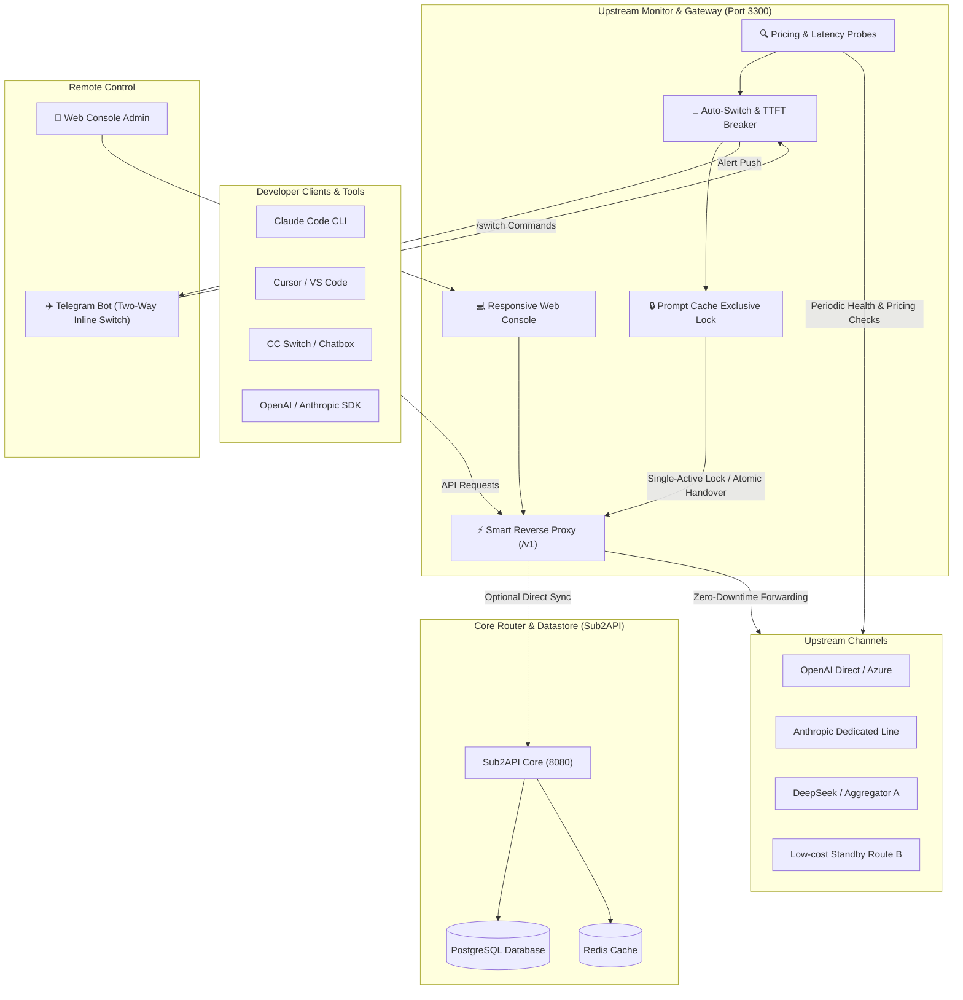

<div align="center">

# 🗼 Relay Tower (中转塔台)

**Full-Stack Enterprise AI Model Relay Router · Intelligent Upstream Rate Multiplier Monitor · Millisecond Zero-Downtime Hot Switching · Prompt Cache Affinity Lock · Telegram Remote Console Bot**

[](LICENSE)
[](https://nodejs.org/)
[](docker-compose.yml)
[](https://claude.ai)
[](https://cursor.com)
[](CONTRIBUTING.md)
[](https://telegram.org)

[English](README_EN.md) · [简体中文](README.md) · [Why Relay Tower?](#-why-relay-tower-comparison) · [Key Features](#-key-features-matrix) · [Architecture](#-architecture) · [Quick Start](#-quick-start) · [Client Setup](#-client-integration-guide) · [FAQ](#-faq)

</div>

---

## 📌 GitHub Discoverability & Topics

> **Keywords:** `ai-gateway` `llm-proxy` `claude-code` `cursor-ai` `deepseek-api` `openai-proxy` `anthropic-proxy` `new-api` `one-api` `prompt-cache` `rate-limiter` `circuit-breaker` `load-balancer` `telegram-bot` `docker-compose` `reverse-proxy`

---

## 📖 Introduction

Developers and operators managing AI model API proxies constantly face critical operational bottlenecks:
1. **Stealth Upstream Price Hikes**: Providers frequently increase wholesale multipliers silently during peak hours, creating severe margin losses;
2. **Round-Robin Multi-Channel Routing Destroys Prompt Cache**: Operating multiple standby channels simultaneously causes requests to alternate between different upstream instances. This **drops the Prompt Cache hit rate to zero, doubling token bills and spiking latency**;
3. **Unexpected Provider Downtime While Away From Keyboard**: Sudden upstream outages at night cannot be resolved without immediate access to an operations laptop;
4. **Disruptive Client Reconfiguration**: Traditional proxies require restarting clients or modifying client configs to change providers.

**Relay Tower (中转塔台)** is an enterprise-ready, open-source solution designed to solve these challenges. It integrates an **intelligent upstream rate multiplier monitor**, a **zero-downtime reverse proxy endpoint (`/v1`)**, a **two-way interactive Telegram Bot**, and a turnkey **Docker Compose deployment suite**.

---

## ⚖️ Why Relay Tower? (Comparison)

| Feature / Capability | Standard Reverse Proxy (Nginx) | Standalone One-API / New-API | **Relay Tower (This Project)** |
| :--- | :---: | :---: | :---: |
| **Wholesale Multiplier Probe & Differential Detection** | ❌ No | ❌ Fixed manual rate only | ✅ **Sub-second differential price detection** |
| **Price Hike Siren & Failover Circuit Breaker** | ❌ No | ❌ No | ✅ **Audio/visual + Telegram alert with 1-click failover** |
| **Prompt Cache Single-Active Exclusive Lock** | ❌ Round-robin drift | ❌ Dual-active breaks caching | ✅ **Exclusive feature: Standbys set to cold stop, 90%+ cache hit rate** |
| **Telegram Two-Way Interactive Remote Switcher** | ❌ No | ❌ One-way notification only | ✅ **Inline Keyboard: Switch active channels in 1 tap from mobile** |
| **Client Zero-Downtime Hot Switching (`/v1`)** | ❌ Requires config reload | Requires admin panel login | ✅ **Zero downtime: Clients point to unified ingress with zero restarts** |
| **Time-To-First-Token (TTFT) Outage Breaker** | ❌ HTTP 5xx only | ❌ Basic timeout only | ✅ **Tracks stream start latency; auto-switches on stalls** |
| **Real-time Spread & Profit Margin Auditing** | ❌ No | ❌ Usage logging only | ✅ **Real-time gross margin & loss-route auditing** |
| **Zero Public IP Needed for Mobile Ops** | ❌ Requires domain & SSL | Requires public panel | ✅ **Telegram Bot uses Long Polling, works behind NATs** |

---

## ✨ Key Features Matrix

### 1. 📊 Real-Time Upstream Multiplier Matrix & Probes
- **Instant Cost Transparency**: Interfaces with New-API / One-API `/api/pricing` endpoints to show real-time wholesale multipliers (e.g., `0.65x`, `0.85x`, `1.10x`).
- **Latency & Round-Trip Probes**: Periodically sends lightweight probes to verify network latency (ms) and availability.
- **Dynamic Spread & Margin Calculation**: Evaluates pricing differentials against customer retail groups and highlights unprofitable channels in red.

### 2. 🚨 Differential Price Spike Alerts
- **Differential Algorithm**: Captures rate adjustments in sub-seconds (e.g., `0.65x -> 1.10x (+69.2%)`).
- **Multi-Sensory Warnings**: Centered modal alerts + Web Audio synthesized alarm sirens + full audit logs.
- **Primary Route Surge Breaker**: Triggers an alert when your currently active route undergoes a price increase, with a **1-click instant switch button** to lower-cost backups.

### 3. 🔒 Single-Active Exclusive Mode & Prompt Cache Lock (Breakthrough)
- **Eliminates Concurrent Round-Robin**: Only the active primary channel (`priority=100`) remains `schedulable=true`. All other standby channels in the group are forced to cold standby (`schedulable=false, priority=10`).
- **Maximizes Prompt Cache Hit Rate**: Ensures continuous context requests (Claude Code, Cursor, DeepSeek) consistently hit the exact same upstream instance, **slashing prompt token expenses by up to 70%+ while reducing latency**.
- **Atomic Mutex Handover**: Manual or automated failover performs an atomic SQL transaction, ensuring zero multi-channel overlap during transitions.

### 4. ⚡ Zero-Downtime Smart Reverse Proxy Gateway
- **Unified Ingress**: Exposes a unified endpoint at `http://localhost:3300/v1`.
- **Zero Client Interruption**: Any tool pointing to this address switches upstream providers instantly with **zero downtime and zero configuration changes**.
- **Integrated Test Bench**: Verify routing and stream output directly from the web console.

### 5. ✈️ Telegram Bot Remote Console
- **Push Alerts**:
  - Live multiplier adjustments with percentage change.
  - High-severity primary route price surge alarms with inline **1-click switch buttons**.
  - Automatic TTFT timeout or downtime reports.
- **Interactive Two-Way Management**:
  - `/status`: Review active route, wholesale rate, gross margin, latency, and cache lock status.
  - `/switch`: Renders an interactive **Inline Keyboard** for 1-tap mobile channel switching.
  - `/auto`: Toggle automatic TTFT failover and strategy modes.
  - `/rates`: Display leaderboard of providers sorted by lowest multiplier.
  - `/check`: Trigger on-demand latency and pricing probes across all channels.
- **NAT-Friendly Long Polling**: Works behind corporate firewalls, local dev machines, or NAT VPS instances without a public IP or SSL certificate.

### 6. 🛡️ Automated TTFT Circuit Breaker
- Continuously monitors Time to First Token (TTFT). If a channel hangs, experiences TTFT spikes, or exceeds error thresholds, the gateway automatically switches to qualified candidate routes.

---

## 🏗️ Architecture



---

## 📂 Repository Structure

```
├── 🚀 upstream-monitor/            # Core system: Upstream monitor & gateway
│   ├── public/                    # Modern responsive Web UI (Dashboard, Policy, Testbench)
│   ├── server.js                  # Smart reverse proxy (/v1), TTFT breaker & audit core
│   ├── telegram.js                # Long-polling Telegram Bot with interactive inline keyboard
│   ├── auth.js                    # PBKDF2 authentication, session persistence & anti-bruteforce
│   ├── Dockerfile                 # Container definition
│   └── data/                      # Example configuration templates
│       ├── channels.example.json           # Example channel configuration
│       ├── telegram_config.example.json    # Example Telegram Bot settings
│       └── auto_switch_config.example.json # Example switch policy settings
├── 🐳 docker-compose.yml           # Full-stack deployment (Sub2API + PG + Redis + Monitor)
├── ⚙️ .env.example                 # Root environment configuration template
├── 📖 CONTRIBUTING.md              # Contribution guidelines
├── 🛡️ SECURITY.md                  # Security disclosure policy
└── 📄 LICENSE                      # MIT License
```

---

## 🚀 Quick Start

### Option 1: Docker Compose Full-Stack (Recommended)

Get a complete production environment up and running in 60 seconds:

```bash
# 1. Clone repository
git clone https://github.com/oisano11/relay-tower.git
cd relay-tower

# 2. Prepare environment files
cp .env.example .env
cp upstream-monitor/.env.example upstream-monitor/.env

# 3. Launch all containers
docker-compose up -d
```

Access the interfaces:
- **Upstream Monitor Console**: `http://localhost:3300`
- **Unified Proxy Ingress**: `http://localhost:3300/v1`
- **Sub2API Admin**: `http://localhost:8080`

---

### Option 2: Standalone Upstream Monitor (Node.js)

If you already operate an existing New-API or One-API deployment:

```bash
cd upstream-monitor

# 1. Install dependencies
npm install

# 2. Initialize configuration
cp .env.example .env
cp data/channels.example.json data/channels.json
cp data/telegram_config.example.json data/telegram_config.json
cp data/auto_switch_config.example.json data/auto_switch_config.json

# 3. Start the console
node server.js
# Or run with startup script
./scripts/start.sh
```

Navigate to `http://localhost:3300`. An initial admin password will be generated and printed to the terminal on first launch.

---

## 💻 Client Integration Guide

Point your client tools to `http://localhost:3300/v1` to benefit from **Prompt Cache Affinity** and **Zero-Downtime Hot Switching**:

### 1. Claude Code CLI
```bash
export ANTHROPIC_BASE_URL="http://localhost:3300"
export ANTHROPIC_API_KEY="sk-your-relay-key"
claude
```

### 2. Cursor / VS Code
- **OpenAI Base URL**: `http://localhost:3300/v1`
- **API Key**: `sk-your-relay-key`
- Works seamlessly with Claude 3.7 Sonnet, DeepSeek V3, and GPT-4o.

### 3. Python (OpenAI SDK)
```python
from openai import OpenAI

client = OpenAI(
    base_url="http://localhost:3300/v1",
    api_key="sk-your-relay-key"
)

response = client.chat.completions.create(
    model="claude-3-7-sonnet-20250219",
    messages=[{"role": "user", "content": "Explain Prompt Cache optimization!"}]
)
print(response.choices[0].message.content)
```

### 4. TypeScript / Node.js
```typescript
import OpenAI from 'openai';

const openai = new OpenAI({
  baseURL: 'http://localhost:3300/v1',
  apiKey: 'sk-your-relay-key',
});

async function main() {
  const completion = await openai.chat.completions.create({
    model: 'gpt-4o',
    messages: [{ role: 'user', content: 'Ping!' }],
  });
  console.log(completion.choices[0].message.content);
}
main();
```

---

## ✈️ Telegram Bot Setup & Commands

### 1. Create Bot & Obtain Token
1. Open Telegram and start a chat with `@BotFather`.
2. Send `/newbot` and follow the prompts to choose a display name and username.
3. Copy the token provided (e.g., `123456789:ABCdefGhIJKlmNoPQRsTUVwxyZ`).
4. Paste it into the Web Console **Telegram Settings** dialog or into `TELEGRAM_BOT_TOKEN` in `upstream-monitor/.env`.

### 2. Zero-Password Admin Binding
- Start a direct chat with your bot and send `/start`.
- The first user to message `/start` is **automatically authenticated and bound as the super administrator**.

### 3. Command Reference

| Command | Purpose | Interaction |
| :--- | :--- | :--- |
| `/status` | Status Briefing | Reports active channel, rate, profit margin, latency, and cache lock state |
| `/switch` | Interactive Dispatcher | Pops up an **Inline Keyboard** to switch channels with one tap |
| `/auto` | Circuit Breaker Control | Toggles automatic failover and TTFT breaker policies |
| `/rates` | Pricing Leaderboard | Outputs all available upstream channels ranked from lowest to highest multiplier |
| `/check` | On-Demand Audit | Triggers an immediate latency test and pricing probe across all providers |

---

## ⚙️ Configuration Reference

### Root Environment (`.env`)

| Variable | Default | Description |
| :--- | :--- | :--- |
| `BIND_HOST` | `0.0.0.0` | Ingress listening IP |
| `SERVER_PORT` | `8080` | Sub2API port |
| `POSTGRES_PASSWORD` | - | PostgreSQL password (Required) |
| `REDIS_PASSWORD` | - | Redis password |
| `JWT_SECRET` | - | Session signing secret (`openssl rand -hex 32`) |
| `ADMIN_EMAIL` | `admin@example.com` | Initial admin account email |
| `ADMIN_PASSWORD` | - | Initial admin account password |
| `MONITOR_PORT` | `3300` | Upstream Monitor dashboard port |

### Monitor Environment (`upstream-monitor/.env`)

| Variable | Default | Description |
| :--- | :--- | :--- |
| `PORT` | `3300` | Console and proxy gateway port |
| `ADMIN_PASSWORD` | Random 16-hex | Dashboard password (logged on initial run) |
| `TELEGRAM_BOT_TOKEN` | - | Telegram Bot API token |
| `IS_VPS` | `false` | True if running alongside local Sub2API container |
| `SSH_HOST` | - | Remote host if connecting to external database container |

---

## ❓ FAQ

### Q1: Why is "Single-Active Exclusive Mode" important for Prompt Cache?
> **Answer**: LLM architectures (e.g. Claude 3.7, DeepSeek) tie prompt caching to specific upstream instances. When requests are split between multiple providers, long-context prompts must be repeatedly recalculated, dropping cache hit rates to zero. Single-Active Exclusive Mode forces secondary channels into cold standby (`schedulable=false`), ensuring **consistent 90%+ cache hit rates and reducing token costs by up to 70%**.

### Q2: Does the Telegram Bot need a public IP or open port?
> **Answer**: **No.** The bot uses Telegram's official `Long Polling` protocol. It initiates outbound HTTPS requests to Telegram servers, functioning flawlessly behind NATs, home routers, and firewalls without open inbound ports.

---

## 🤝 Contributing

Contributions are welcome!
1. Please read [CONTRIBUTING.md](CONTRIBUTING.md) before submitting code.
2. Review our responsible disclosure policy in [SECURITY.md](SECURITY.md).
3. Follow the Conventional Commits specification for PRs.

---

## 📄 License

Distributed under the [MIT License](LICENSE). Free for commercial and private use.
